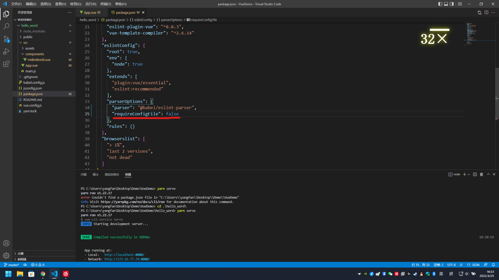

# Vue-CLI

## 安装 CLI

```
npm install -g @vue/cli
```
或
```
yarn global add @vue/cli
```

## 更新 CLI
```
npm update -g @vue/cli
```
或
```
yarn global upgrade --latest @vue/cli
```

## 创建一个项目
```
vue create <项目名称>
```
!!! 项目名称不能有大写字母  
vue 是热缓存的  
所以在后台修改代码后不用刷新页面也会该变在后台修改的东西  

# 关于新创建一个项目后一些文件第一行报错的解决方法
在 package.json 文件中 找到 **parserOptions**  
在里面加入下面的属性即可解决报错问题
```
"requireConfigFile": false
```

