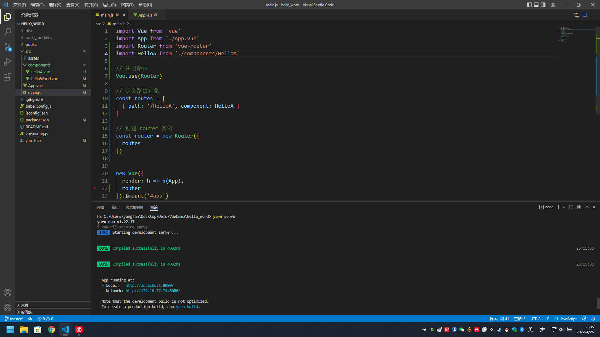
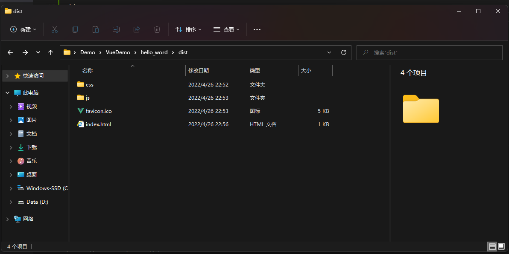
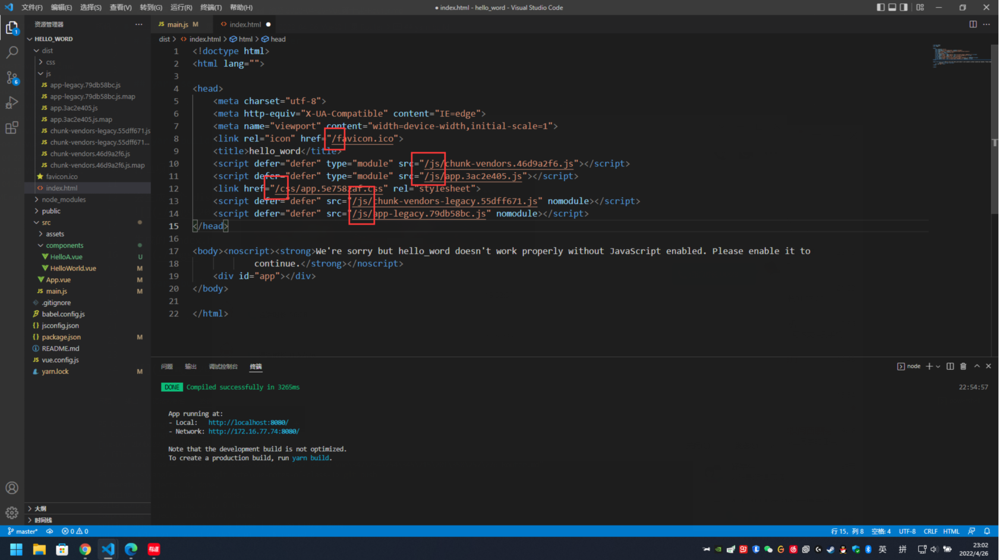
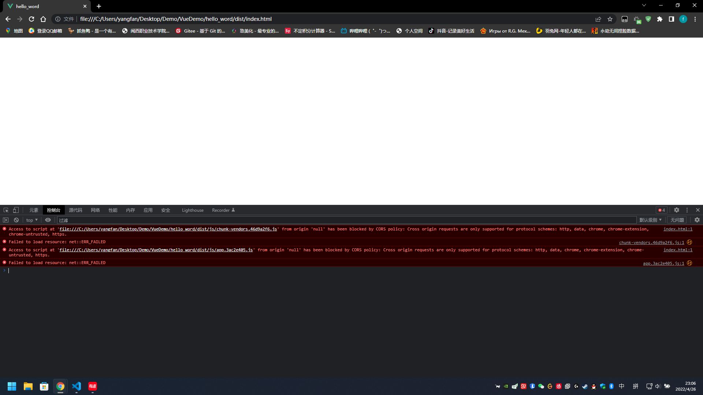
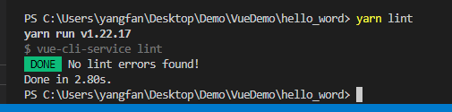
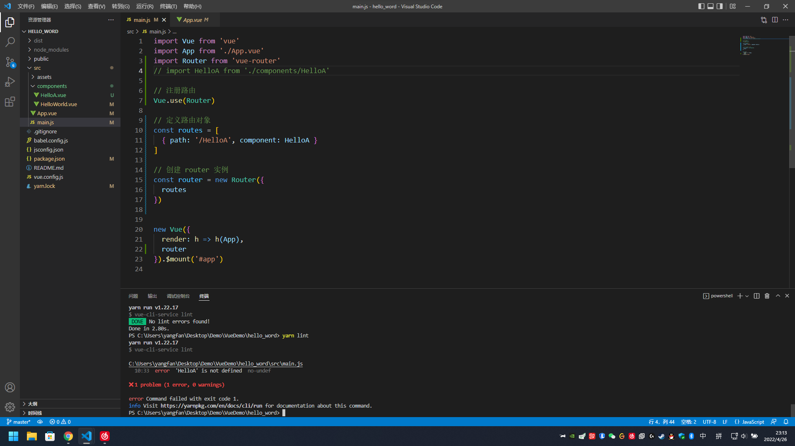

# 打包

## yarn serve
运行项目

## yarn build

打包项目

会生成一个 dist 文件夹，里面有以下文件 👇   

生成的 index.html 文件里的引用都不是相对路径，需要修改为相对路径(不知道是不是只有我会)  
  

但是改完后还是会报错 👇  

翻译为：CORS跨源请求只支持协议方案:http, data, chrome-extension, edge, https, chrome-untrusted。  

暂时没有深入了解，等以后有空再解决
## yarn lint
看上去是查错的  
  

随便把一行引用注释掉就报错了  
  

