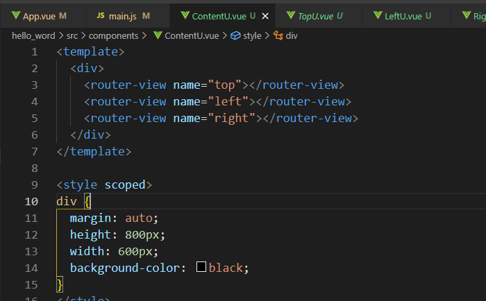

# 嵌套、命名路由

## 嵌套路由
要在嵌套的出口中渲染组件，需要在 VueRouter 的参数中使用 children 配置
```js
const router = new Router({
    routes: [
    {
        path: '/',
        component: User,
        children: [
            {path: '/index',component: IndexU},
            {path: '/about',component: AboutU},
        ]
    }
]
})
```

## 命名路由
你可以在界面中拥有多个单独命名的视图，而不是只有一个单独的出口  
如果 router-view 没有设置名字，那么默认为 default  

```js
const router = new Router({
    routes: [
    {
        path: '/',
        component:ContentU
        components: {
            top: TopU,
            left: LeftU,
            right: RightU
        }
    }
]
})
```

## 嵌套命名视图
```js
const router = new Router({
    routes: [{
        path: '/',
        component: ContentU,
        children: [{
            path: '/',
            components: {
            top: TopU,
            left: LeftU,
            right: RightU,
            }
        }]
    }]
})
```
