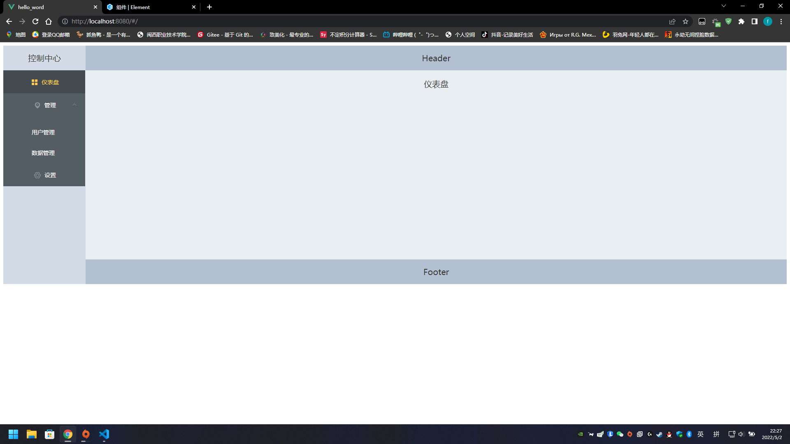
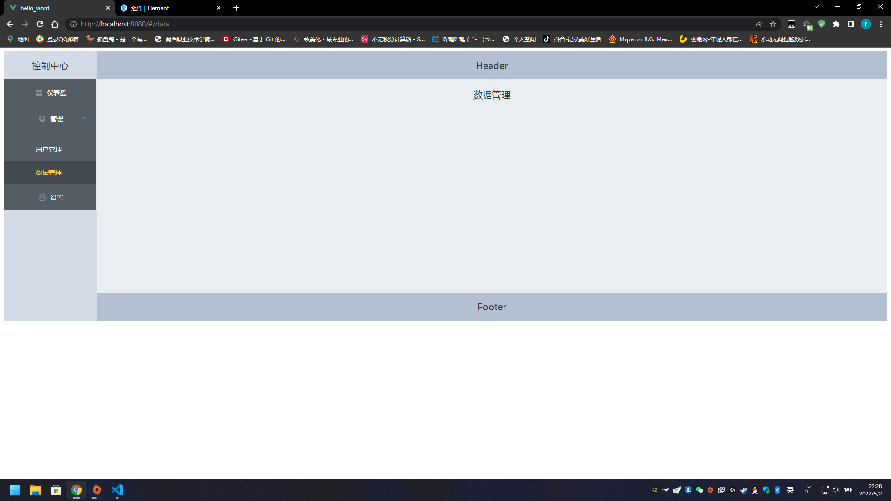

# 菜单栏

el-menu 的一些参数
+ default-active
当前激活菜单的 index，就是刷新页面后默认的

+ router  
是否使用 vue-router 的模式，启用该模式会在激活导航时以 index 作为 path 进行路由跳转  

+ unique-opened  
是否只保持一个子菜单的展开  

+ mode  
模式，可选值为：horizontal / vertical  

+ menu-trigger  
子菜单打开的触发方式(只在 mode 为 horizontal 时有效)  
可选值为：hover / click

  
  
  